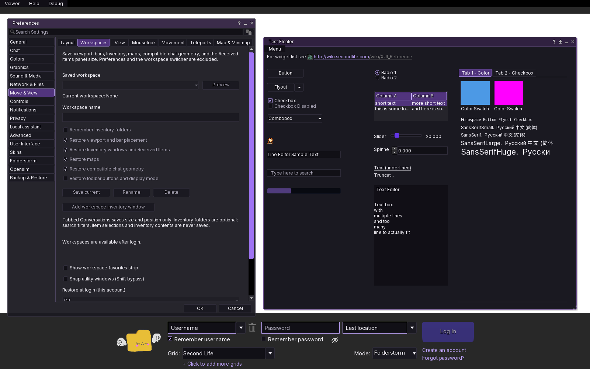
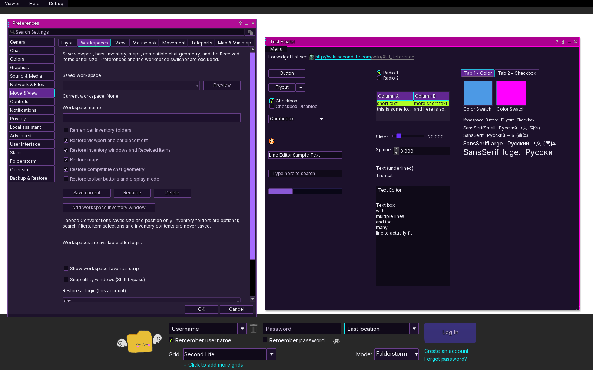
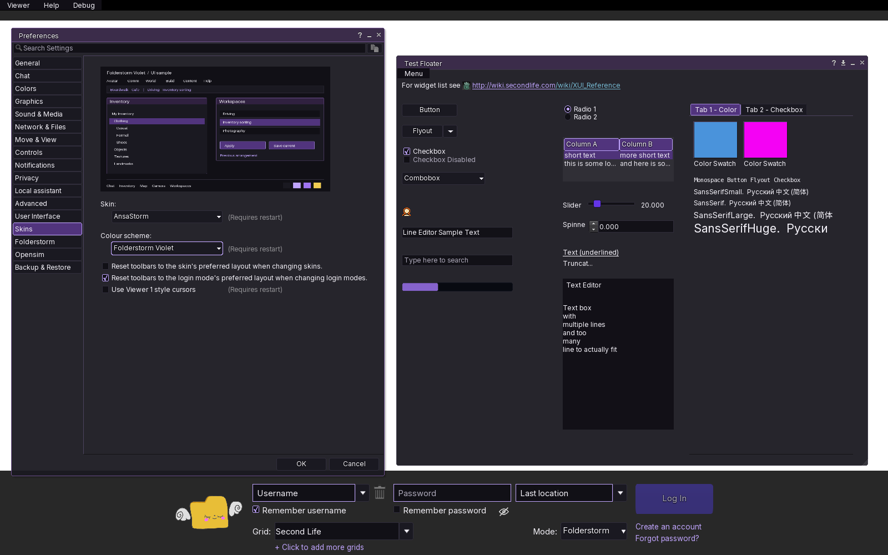
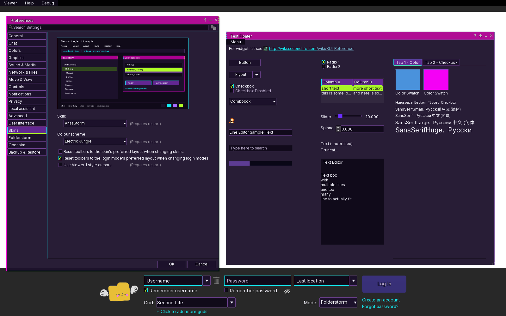

# Folderstorm Violet and Electric Jungle for Folderstorm and AnsaStorm

Choose **Preferences → Skins → Skin: Folderstorm or AnsaStorm**, then select
either new theme (called **Colour scheme** in AnsaStorm). Click OK and restart
the viewer, as with the existing themes.
The current theme remains the default; both additions are opt-in.

**Folderstorm Violet** follows folderstorm.sodie.net: near-black purple
surfaces, lavender and violet accents, off-white text and warm gold highlights.
**Electric Jungle** uses dark plum surfaces, magenta headers, cyan outlines,
violet buttons, lime list/menu selections and small patterned frame accents.
Inventory uses a darker green selection so library entries, links and favorite
text remain readable; those entries have separate foreground-color rules.

Each palette uses the selected skin's existing layout, language files and
icons. They supply colors and chrome for windows, navigation, buttons, tabs,
dropdowns, text fields, scrollbars, sliders, progress bars, checkboxes and radio
buttons. Their illustrative selector previews are UI samples, not viewer
screenshots. The mockup's spacing and window contents are not layout changes.
World rendering, map/status warning colors and existing skin defaults are
unchanged. The normal Skins preference for resetting toolbar arrangements
still applies; turn it off before changing themes to retain custom toolbars.

## Authoring

Generated resources are committed, so building or running the viewer does not
require Pillow. To regenerate them, use Python 3 and Pillow >= 10.1:

```sh
python3 scripts/skins/generate_folderstorm_themes.py
```

The script draws original assets from shared palette definitions. It reads the
selected skin's images only for dimensions, preserves their filenames and
existing nine-slice registrations, and excludes icons and animated loading
sprites. Each Folderstorm palette has 117 chrome textures; each AnsaStorm
palette has 121, including its transparent checkbox variants.

AnsaStorm has additional accent aliases and an RGB window tint. Its theme
floater template retains every original AnsaStorm default and changes only the
two image tint colors, keeping its existing 66% alpha. Widget templates use
CURRENT_SKIN lookup, so this template includes all original attributes rather
than relying on partial inheritance. Generated colors also retain AnsaStorm's
accent/background alpha variants and hyperlink roles. The manifest now includes
theme widget XML alongside the existing color/texture globs. No application-code
or runtime dependency changes are needed. AnsaStorm Modern is a separate skin
and is not changed by this addition.

## Focused validation

Original Folderstorm checks with Pillow 12.3.0:

- Both registered theme names, their folders and globally available preview
  image names match the existing skin selector's lookup rules.
- The four changed/new XML files parse. Each theme has 119 unique color names;
  all non-palette overrides are existing color roles and references resolve.
  Numeric colors have four components in the valid range.
- Each theme's 117 RGBA chrome textures has the corresponding inherited
  dimensions and nonempty content. All theme assets and previews match the
  existing packaging wildcard rules without running packaging.
- Main text against panel, input, selected-button, title and Inventory fills;
  muted text against panels; selected Inventory links/favorites; and Electric
  Jungle menu/list text against lime all exceed 4.5:1 in the opaque palette.
  Minimum checked ratios: Violet 4.65:1, Electric Jungle 6.05:1. User transparency
  settings and native overlays still need visual acceptance.
- Regeneration produces identical resources with the installed Pillow version.
- The complete diff passes whitespace checks; the authored PNGs were inspected.

The original focused checks did not include a viewer build.

## Native Linux preview

On October 5, 2026, a local viewer was built with current main and PRs #5, #6
and #7 combined in an isolated checkout. The ReleaseFS_open_AVX2 configuration
used GCC 14, `-O1 -g0`, nonfatal compiler warnings, tests off and packaging off.
Normal resource staging needed local links for binaries placed in the OpenJPEG
build directory. The Go helper was compiled with VCS stamping disabled; no Go
tests, installer/archive packaging or GitHub builds were run.

Both themes were launched on a 1600 × 1000 virtual display with Mesa llvmpipe.
The captures below are actual viewer screenshots at login, showing Preferences
and the built-in widget test floater. The login browser pane is blank and no
account was logged in. Workspace actions correctly remain unavailable at login;
these screenshots do not verify account-dependent workspace restoration.





Checked native headers, tabs, buttons, checkbox/radio states, list selections,
inputs, dropdowns, sliders, scrollbars and window resizing. The preview exposed
two small visual fixes: room for the Layout introduction's third line in the
workspace PRs, and Electric Jungle's diagonal strokes bleeding into stretched
title pixels. Its generator now keeps all strokes within the four-pixel edge
slices; a pixel check confirms the stretch center remains uniform.

Viewer UI API corrections found during compilation are published in PR #5 and
carried into PR #6. Both changed C++ files compiled and the combined viewer
linked successfully. This is a preview build, not a Windows or production-build
acceptance result.

## AnsaStorm native preview

The same two palettes are also registered under **AnsaStorm** after its four
existing schemes. Each has 132 unique color names, valid component ranges and
resolvable references; shared Firestorm-only roles are omitted. Checked all 121
texture dimensions and RGBA content against AnsaStorm/default resources, the
full floater defaults against the original AnsaStorm template, and the manifest
coverage of its two theme widget files. Regeneration is deterministic, and
existing Folderstorm theme resources remain byte-for-byte unchanged.

Both AnsaStorm themes were run and inspected using the already-built Linux
viewer, with no new compilation, installer/archive packaging, GitHub builds or
unrelated tests. The selector lists both additions, resolves their previews and
shows the active AnsaStorm scheme. Headers, window buttons, selected controls,
text, dropdowns and resized floaters render correctly at login; no missing
floater-image warnings remain. These captures show the actual native selector
and widget floater. The small image inside Skins is the illustrative palette
preview, not logged-in Inventory or workspace contents.





## Native acceptance still needed

On Windows, select each theme under both skins, confirm with OK and restart. Check Inventory
including selected links/library/favorites, ordinary and minimized floaters,
Preferences, chat, dropdown arrows, selected/disabled controls and active versus
inactive windows. Confirm navigation and all toolbar orientations, including
the shared workspace/landmark row when PR #5 is installed. Try larger UI scale
and window resizing for stretch artifacts. Canceling a selection should keep
the old skin, and switching back to an existing theme should restore its look.
